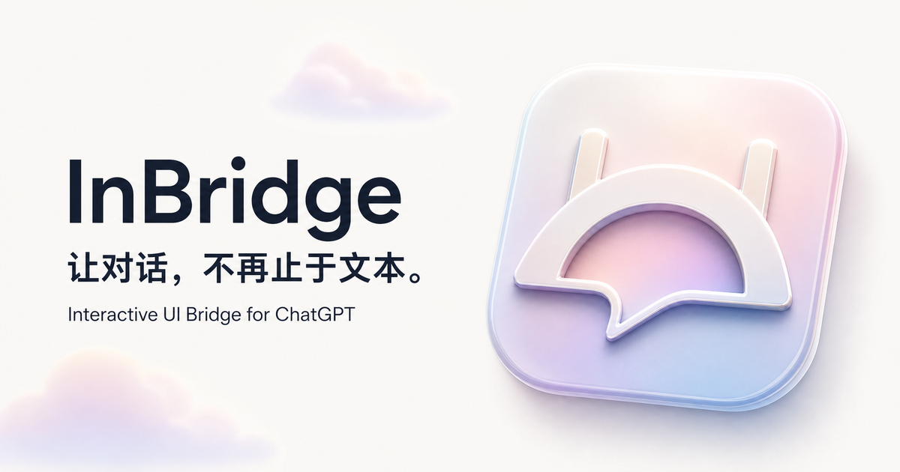
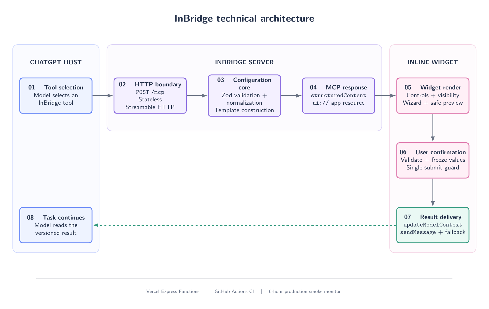

<div align="center">
  
  <h1>InBridge</h1>
  <p><strong>在 ChatGPT 对话中完成清晰、安全、可继续执行的结构化选择。</strong></p>
  <p>个人优先、声明式、无状态的 MCP App。</p>

  <p>
    <a href="README.en.md">English</a>
    ·
    <a href="#部署自己的实例">部署指南</a>
    ·
    <a href="docs/TEMPLATES.md">模板文档</a>
    ·
    <a href="docs/OPERATIONS.md">运维手册</a>
  </p>

  <p>
    <a href="https://github.com/xyzxyq/InBridge/actions/workflows/ci.yml"></a>
    
    
    
    
    
  </p>
</div>

---

## 项目简介

InBridge 是一个面向 ChatGPT 的 MCP App。当模型需要用户选择方案、确认操作或配置参数时，InBridge 会在对话中显示内联交互面板，而不是要求用户用自然语言反复描述选择。



用户确认后，Widget 会把带版本号的结构化结果写回模型上下文，并自动触发下一轮对话。模型因此可以准确读取用户的选择，并继续原任务。

典型闭环如下：

1. 模型调用 InBridge 工具；
2. ChatGPT 加载内联 Widget；
3. 用户选择、填写或取消；
4. Widget 冻结本次结果，防止重复提交和提交中篡改；成功后用“重新选择”替换一次性提交操作，并允许在本地撤销重新选择；
5. 结果通过 `updateModelContext` 写入模型上下文；
6. Widget 通过 `sendMessage` 触发下一轮；
7. 模型读取结构化结果并继续任务。

InBridge 已通过 ChatGPT Developer Mode 的真实闭环验证，并提供 Vercel 与标准 Node.js 自部署配置。仓库不提供共享公共实例，每位用户应部署和管理自己的 MCP 地址。

## 为什么需要 InBridge

对话中的纯文本选择在简单场景下足够，但当选项、约束或参数变多时，容易出现以下问题：

- 用户需要手动复制选项名称或参数；
- 模型可能误读模糊表达；
- 多字段配置缺少必填校验和实时摘要；
- 方案对比难以保持信息结构一致；
- 用户确认后仍需再发送一句话，模型才会继续；
- Host 能力或网络异常时，选择结果可能无法可靠传递。

InBridge 将这些问题收敛为一个受控的声明式交互协议：模型只描述允许的控件和数据，Widget 负责呈现、校验、确认、回传和降级恢复。

## 当前能力

### 交互控件

| 控件 | 类型 | 适用场景 |
| --- | --- | --- |
| 单选 | `radio` | 方案选择、互斥偏好 |
| 多选 | `checkbox_group` | 标签、环境、能力组合 |
| 下拉选择 | `select` | 候选项较多的单值字段 |
| 滑块 | `range` | 预算、强度、亮度等连续参数 |
| 文本 | `text` | 备注、补充要求 |
| 数字 | `number` | 数量、种子数、阈值 |
| 开关 | `switch` | 启用或禁用某项能力 |
| 颜色 | `color` | 主题色、图表色 |
| 比较卡片 | `comparison_cards` | 并列展示方案说明、优势和限制 |

### 组合能力

- 严格必填校验和聚焦提示；
- 声明式条件显示：`equals`、`not_equals`、`includes`、`not_includes`；
- 隐藏字段自动退出校验、摘要和最终提交；
- 2–8 步向导、当前步骤校验、返回保值和最终确认；
- `summary` 与 `theme_card` 两种安全实时预览；
- 标题、题干、卡片选项、说明与预览支持 KaTeX 数学排版，兼容 `$...$`、`$$...$$`、`\\(...\\)`、`\\[...\\]`，并保守识别常见的无定界符公式；
- 确认与取消使用不同结果语义；
- 提交值冻结、并发提交保护和完成态防重复提交；
- Host 能力检测、自动重试和可复制 JSON 回退；
- MCP 服务身份和生产端点使用项目图标。

## 技术架构



该图由 [LaTeX TikZ 源文件](docs/architecture.tex) 绘制，仓库同时保存了可直接查看的 [PDF 版本](docs/assets/architecture.pdf)。README 使用 PNG 版本，以确保 GitHub、移动端和多数 Markdown 阅读器都能稳定显示。

### 架构分层

| 层 | 职责 | 主要实现 |
| --- | --- | --- |
| HTTP 边界 | 无状态 MCP 请求、健康检查、图标、安全响应和错误隔离 | Express 5、Streamable HTTP |
| 配置核心 | Schema 白名单、默认值、交叉字段校验、模板构造和标准化 | Zod 4、TypeScript |
| MCP 层 | 工具发现、工具调用、UI resource 和 Server identity | MCP SDK、MCP Apps SDK |
| Widget 层 | 控件渲染、Host 主题同步、条件显示、向导、预览、可访问性和表单状态 | 原生 DOM、CSS、MCP Apps bridge |
| 结果交付 | 上下文更新、下一轮触发、重试和人工复制回退 | `updateModelContext`、`sendMessage` |
| 生产运维 | 构建门禁、部署、日志、限流和远程烟雾测试 | Vercel、GitHub Actions |

### 无状态服务模型

`POST /mcp` 的每个请求都会创建独立的 `McpServer` 和 `StreamableHTTPServerTransport`，不依赖进程内会话状态。交互状态只存在于当前 Widget 中，确认结果通过标准 Host 能力回到对话。

这种设计适合 Serverless 部署，并减少跨用户状态污染和服务端清理成本。

### Widget 交付方式

Vite 将 Widget 编译为单个 IIFE JavaScript 文件和一个 CSS 文件。MCP resource 在读取时将两者内联到 HTML 中，并以 `text/html;profile=mcp-app` 返回。KaTeX 解析器随 Widget 本地打包并输出原生 MathML，不依赖 CDN 或外部字体；当前 Widget 不需要外部脚本、样式、图片或网络请求。公式渲染保持 `trust: false`，无效表达式会安全回退为原文。

Widget 通过 MCP Apps `hostContext.theme` 跟随 ChatGPT 的当前浅色或深色外观，并监听运行时主题变化；Host 未提供主题时才回退到系统 `prefers-color-scheme`。Host 下发的 `--color-*-info` 和 ring 语义令牌会进一步驱动选中卡片、单选框、开关、滑块与焦点环，使其同步用户在 ChatGPT 中设置的重点色；旧版 Host 未提供这些令牌时使用可访问的蓝色回退。颜色、边框、表面和焦点状态均由语义设计令牌驱动，避免主题切换时出现突兀的卡片。

## MCP 接口

### 服务端点

| 端点 | 方法 | 说明 |
| --- | --- | --- |
| `https://<你的域名>/` | `GET` | 产品首页与本地交互演示 |
| `https://<你的域名>/mcp` | `POST` | 无状态 Streaming HTTP MCP endpoint |
| `https://<你的域名>/health` | `GET` | 服务健康状态与版本 |
| `https://<你的域名>/icon.png` | `GET` | 项目和 MCP 服务图标 |

### MCP Tools

| Tool | 说明 |
| --- | --- |
| `render_interaction_template` | 常见决策、确认、配置和比较的首选入口；直接渲染严格校验的模板 |
| `ask_user_interactively` | 内置模板无法覆盖时，生成自定义声明式交互 |
| `list_interaction_templates` | 仅在无法从任务判断模板时，作为低频目录兜底 |

普通调用无需先枚举模板：常见意图直接使用 `render_interaction_template`；只有确实需要自定义字段组合时才使用 `ask_user_interactively`。

### 内置模板

| 模板 | 用途 | 关键能力 |
| --- | --- | --- |
| `decision` | 单选或多选决策 | 摘要、默认值、必填控制 |
| `confirmation` | 执行前确认或拒绝 | 确认、拒绝、取消三种独立语义 |
| `experiment_config` | 机器学习实验设计 | 9 个字段、三步向导、条件消融配置 |
| `theme_config` | 主题与视觉参数 | 颜色、亮度、密度、风格实时预览 |
| `comparison` | 技术选型与方案比较 | 2–6 张单选卡片、优势与限制 |

完整参数见 [模板文档](docs/TEMPLATES.md)。

## 结果协议与失败恢复

确认结果始终使用稳定、可版本化的结构：

```json
{
  "version": "1",
  "interactionId": "choose_plan_001",
  "status": "confirmed",
  "values": {
    "choice": "safe"
  },
  "submittedAt": "2026-07-20T12:00:00.000Z"
}
```

取消时 `status` 为 `cancelled`，且 `values` 始终是空对象，防止未确认输入意外影响模型。

Widget 根据 Host 能力和调用结果区分四种交付状态：

| 状态 | 含义 |
| --- | --- |
| `sent_with_context` | 结构化上下文和下一轮触发消息都成功 |
| `sent_with_inline_result` | 上下文更新不可用，完整 JSON 随消息发送 |
| `context_only` | 结果已写入上下文，但触发消息失败，可重试 |
| `manual_copy` | 两种 Host 能力都不可用，可重试或复制 JSON |

提交开始后，表单值会被冻结。同一份冻结结果可以安全重试，不会再次读取或修改表单内容。成功交付后，提交与原始取消操作会从界面移除，只保留“重新选择”。重新选择会进入本地草稿态，并显示“取消重新选择”：用户若取消，Widget 会恢复此前的控件值、向导步骤、完成提示和冻结结果，不调用 `updateModelContext` 或 `sendMessage`；只有再次确认提交才会向 GPT 交付新结果。

渲染工具显式声明标准 `ui.visibility: ["model", "app"]` 和 ChatGPT 兼容的 `openai/visibility: "public"`，并提供 Widget 描述与调用状态，使 Host 将它作为公开对话工具呈现；Widget 自身只渲染工具结果，不会操作或替代外围对话中的用户消息。

## 安全边界

InBridge 的最高原则是：模型提供数据和声明，不提供可执行 UI。

- 所有输入对象使用严格 schema，未知字段会被拒绝；
- 控件数量、字符串长度、选项数量和数组长度都有上限；
- 不接受模型提供的 HTML、JavaScript、CSS、表达式或事件处理器；
- 不接受图片 URL、外部资源 URL 或任意网络请求；
- 条件控件只能引用之前出现的控件，禁止自引用、后向引用和循环；
- preview 只能绑定到类型兼容的现有控件；
- 请求体上限为 64 KB；
- 错误响应不会回显请求正文或用户选择；
- 日志只记录请求 ID、路径、状态和耗时；
- 响应包含 `nosniff`、无 referrer、受限 Permissions Policy 等安全头；
- Vercel Firewall 对 `/mcp` 执行 IP 限流。

## 快速开始

### 环境要求

- Node.js 22.x；
- npm 11 或兼容版本；
- 如需连接 ChatGPT，需要可使用 Developer Mode 和自定义 MCP App/Connector。

### 安装与构建

```bash
git clone git@github.com:xyzxyq/InBridge.git
cd InBridge
npm install
npm run build
npm start
```

服务默认监听 `http://localhost:3000`：

```text
GET  http://localhost:3000/health
GET  http://localhost:3000/icon.png
POST http://localhost:3000/mcp
```

使用其他端口：

```bash
PORT=4100 npm start
```

PowerShell：

```powershell
$env:PORT = "4100"
npm start
```

### 开发模式

```bash
npm run build:ui
npm run dev
```

服务端由 `tsx watch` 自动重启。修改 UI 后需要重新执行 `npm run build:ui`，因为服务端从 `dist/ui` 读取并内联 Widget bundle。

## 部署自己的实例

InBridge 不提供供所有用户共享的公共 MCP 地址。推荐 Fork 本仓库并部署到你自己的 Vercel 账户，这样请求量、免费限额、日志和域名都归你管理。

[](https://vercel.com/new/clone?repository-url=https%3A%2F%2Fgithub.com%2Fxyzxyq%2FInBridge)

### 使用 Vercel

1. Fork 本仓库，或点击上方 **Deploy with Vercel**；
2. 在 Vercel 中导入你的 Fork，并保持仓库内的 `vercel.json` 配置；
3. 完成部署后访问 `https://<你的域名>/health`，确认返回 `status: "ok"`；
4. 你的 MCP 地址就是 `https://<你的域名>/mcp`；
5. 如果使用自定义域名，建议设置生产环境变量 `INBRIDGE_PUBLIC_URL=https://<你的域名>` 后重新部署。

在 Vercel 上未设置 `INBRIDGE_PUBLIC_URL` 时，服务会自动读取 `VERCEL_PROJECT_PRODUCTION_URL`。在其他 Node.js 平台上，请显式设置 `INBRIDGE_PUBLIC_URL`，确保 MCP 图标与 Widget 元数据指向你的公开 HTTPS 域名。

### 使用普通 Node.js 服务

```bash
git clone https://github.com/xyzxyq/InBridge.git
cd InBridge
npm ci
npm run build
INBRIDGE_PUBLIC_URL=https://mcp.example.com PORT=3000 npm start
```

请在反向代理或托管平台上配置 HTTPS，然后检查 `/health` 与 `/mcp`。不要把他人的演示或私人实例地址用于长期调用。

## 接入 ChatGPT

1. 按上一节部署你自己的 InBridge 实例；
2. 在 ChatGPT 设置中启用 Developer Mode；
3. 在 Apps/Connectors 管理页面创建或编辑自定义 MCP App；
4. MCP server URL 填写 `https://<你的域名>/mcp`；
5. 保存后刷新或重新连接应用；
6. 在新对话中启用 InBridge；
7. 建议将下方指令添加到 ChatGPT「个性化」设置的「自定义指令」中，让 ChatGPT 在合适的任务里自行判断并主动调用。

### 推荐的自定义个性化指令

复制以下内容：

```text
当任务需要我在多个方案中选择、比较候选项、配置多个参数、设置偏好、确认或拒绝操作，或提供其他结构化输入时，优先主动调用已连接的 InBridge，而不是在消息中罗列冗长的纯文本选项。对于普通决策、确认、实验配置、主题配置或方案比较，直接调用 render_interaction_template，并选择 decision、confirmation、experiment_config、theme_config 或 comparison；不要先调用 list_interaction_templates。只有内置模板无法覆盖时才调用 ask_user_interactively 自定义控件。调用后等待我在面板中确认或取消，再继续原任务。简单事实问答或无需结构化输入的单个短问题不必调用 InBridge。
```

完成设置后，可以用以下提示词验证连接：

```text
请调用 InBridge 的 comparison 模板，用三张比较卡片让我选择实施方案。
每张卡片说明优势和限制，调用后等待我确认。
```

ChatGPT 的设置名称可能随产品版本变化；关键是启用 Developer Mode，并将上述 `/mcp` HTTPS 地址添加为自定义连接器。

## 调用示例

### 使用 comparison 模板

```json
{
  "templateId": "comparison",
  "interactionId": "choose_implementation",
  "title": "选择实施方案",
  "options": [
    {
      "value": "fast",
      "title": "快速方案",
      "description": "优先跑通最小闭环",
      "badge": "交付优先",
      "pros": ["上线快", "改动范围小"],
      "cons": ["长期扩展能力有限"]
    },
    {
      "value": "safe",
      "title": "稳健方案",
      "description": "优先保证长期维护性",
      "badge": "推荐",
      "pros": ["边界清晰", "易扩展"],
      "cons": ["首轮周期更长"]
    }
  ]
}
```

### 使用自定义交互

```json
{
  "interactionId": "plan_choice_001",
  "title": "请选择一个方案",
  "description": "确认后我会按该方案继续。",
  "controls": [
    {
      "id": "plan",
      "type": "radio",
      "label": "方案",
      "required": true,
      "options": [
        { "label": "方案 A", "value": "a" },
        { "label": "方案 B", "value": "b" },
        { "label": "方案 C", "value": "c" }
      ]
    }
  ],
  "submitLabel": "确认并继续",
  "cancelLabel": "取消"
}
```

## 验证与测试

```bash
npm run typecheck
npm test
npm run build
npm run smoke
```

或执行完整发布前校验：

```bash
npm run verify
npm run build
npm run smoke
```

本地 smoke test 会临时启动编译后的服务，并真实执行：

- `GET /health`；
- `GET /icon.png` 和 MCP server identity 图标元数据；
- MCP initialize；
- `tools/list`；
- 模板目录和模板渲染；
- 自定义 `ask_user_interactively` 与旧入口兼容元数据；
- `resources/read` 和内联 Widget 内容检查。

检查生产环境：

```bash
INBRIDGE_BASE_URL=https://mcp.example.com npm run smoke
```

测试覆盖 schema、模板、条件显示、向导、结果协议、Host 降级、HTTP 安全边界和 MCP wire shape。

## 项目结构

```text
InBridge/
├── icon/
│   └── icon.png                 # 项目与 MCP 服务图标
├── src/
│   ├── server/
│   │   ├── app.ts               # Express 应用和 HTTP 路由
│   │   ├── http.ts              # 日志、安全头和错误边界
│   │   ├── mcp.ts               # MCP tools、resource 和服务身份
│   │   ├── public-url.ts        # 自托管公开域名解析
│   │   ├── normalize.ts         # 配置标准化
│   │   ├── schemas.ts           # 声明式交互白名单 schema
│   │   └── templates.ts         # 内置模板目录和构造逻辑
│   ├── site/                     # 独立官网、交互 Demo 与品牌资源
│   └── ui/
│       ├── main.ts              # Widget 渲染和交互状态机
│       ├── bridge.ts            # Host 能力检测与结果交付
│       ├── lifecycle.ts         # 一次性提交与重新选择状态模型
│       ├── result.ts            # 版本化结果协议
│       ├── theme.ts             # Host/系统主题解析
│       ├── visibility.ts        # 条件控件解析
│       ├── wizard.ts            # 向导导航模型
│       └── styles.css           # 响应式 Widget 样式
├── tests/                       # 单元、协议和 HTTP 边界测试
├── scripts/smoke-test.ts        # 本地/远程 MCP 全链路烟雾测试
├── docs/
│   ├── architecture.tex         # TikZ 技术架构图源文件
│   ├── assets/architecture.*    # README 可视化资产
│   ├── TEMPLATES.md             # 模板参数和示例
│   └── OPERATIONS.md            # 发布、监控、日志和回滚
├── server.ts                    # Vercel Express Function 入口
├── vite.config.ts               # Widget IIFE 构建
├── vite.site.config.ts          # 官网独立构建
└── vercel.json                  # 生产构建与 Function 配置
```

## npm 命令

| 命令 | 作用 |
| --- | --- |
| `npm run dev` | 监听服务端 TypeScript 变更 |
| `npm run dev:site` | 启动官网开发服务器 |
| `npm run build:ui` | 构建 Widget JS/CSS |
| `npm run build:site` | 构建独立官网 |
| `npm run build:server` | 编译服务端 TypeScript |
| `npm run build` | 清理并完整构建 UI 与服务端 |
| `npm run typecheck` | 检查服务端和 UI 类型 |
| `npm test` | 运行 Vitest 测试 |
| `npm run verify` | 类型检查后运行测试 |
| `npm run smoke` | 执行本地或远程 MCP 烟雾测试 |

## 部署与运维

将你自己的 Fork 连接到 Vercel 后，生产分支推送会触发构建。Vercel 在替换生产部署前执行：

```text
npm run verify
    ↓
npm run build
    ↓
Vercel Express Function
```

GitHub Actions 对 push 和 pull request 执行相同发布门禁。若需启用每 6 小时的私有生产监控，请在你的 GitHub 仓库中添加 Actions Secret `INBRIDGE_BASE_URL`，值为你自己的站点根地址；工作流不会在仓库中公开该地址。

手动发布：

```bash
vercel --prod
```

日志关联、Firewall 和回滚步骤见 [生产运维手册](docs/OPERATIONS.md)。

## 当前边界与路线图

当前版本专注于一次性、结构化、显式确认的交互，不包含：

- 服务端用户会话或表单持久化；
- 任意富文本、HTML、CSS 或脚本渲染；
- 模型提供的图片和外部 URL；
- 未经确认的自动操作；
- 长期用户偏好存储；
- OAuth 或多租户身份隔离。

已经完成的扩展阶段包括条件控件、多步骤向导、比较卡片、Host 主题同步和独立提交生命周期。后续候选方向：

- 受控 Rich Preview，例如 slide、chart、document preview；
- 经用户明确授权的 Presets；
- 更完整的浏览器级 Widget E2E；
- 键盘与触控设备的专项可访问性回归。

## 设计与参考文档

- [初始开发设计](plan/interactive-chat-ui-bridge-development-spec.md)
- [模板使用说明](docs/TEMPLATES.md)
- [条件控件设计契约](docs/PHASE-8-CONDITIONAL-CONTROLS.md)
- [多步骤向导](docs/PHASE-9-MULTI-STEP-WIZARD.md)
- [Comparison Cards](docs/PHASE-10-COMPARISON-CARDS.md)
- [生产运维手册](docs/OPERATIONS.md)
- [OpenAI Apps SDK 文档](https://developers.openai.com/apps-sdk/)
- [Model Context Protocol](https://modelcontextprotocol.io/)

## 贡献

欢迎通过 Issue 或 Pull Request 提交缺陷、设计建议和兼容性反馈。修改交互协议时，请同时更新 schema、wire-level 测试、模板文档和 smoke test。

提交前请运行：

```bash
npm run verify
npm run build
npm run smoke
```

## 许可证

InBridge 采用 [Apache License 2.0](LICENSE) 开源。你可以在遵守许可证条款、保留版权与许可证声明的前提下使用、修改和分发本项目。
